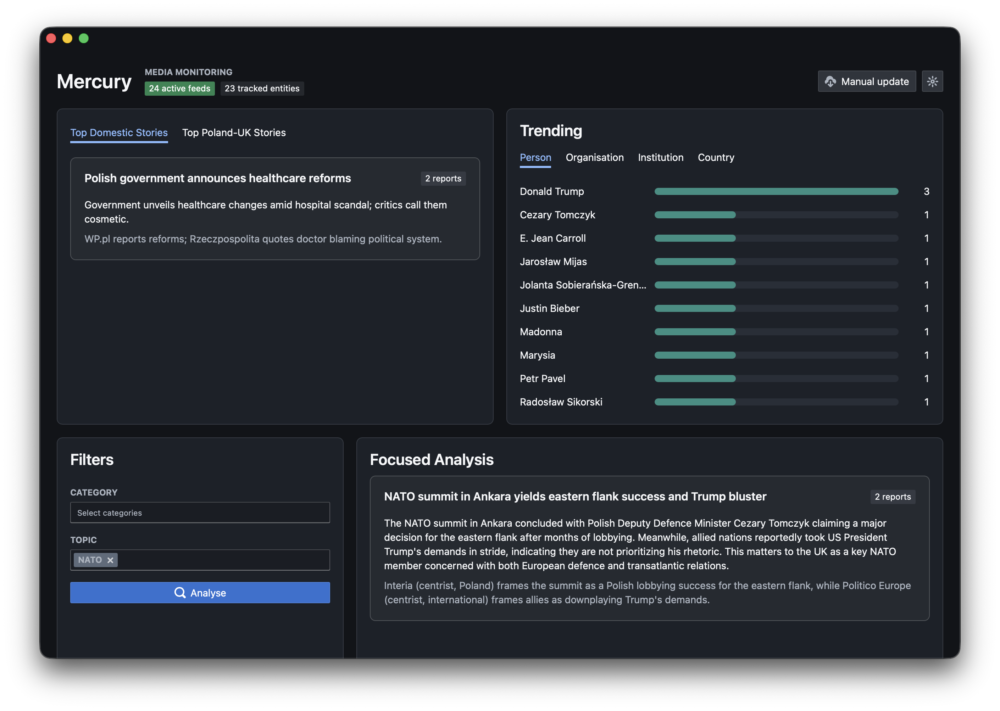

# Mercury

Mercury is a local diplomatic media-intelligence dashboard. It ingests RSS reporting, deduplicates articles, enriches selected new reports with LLM-generated metadata, and presents top stories, entity trends, latest reports, and focused analysis for policy and embassy workflows.

The current app is intentionally manual-refresh by default. This keeps token spend predictable while testing with real content.

The live dashboard is a rolling publication-time snapshot, configured to 24 hours by default. Manual update controls when Mercury polls and recomputes that snapshot; it does not define the reporting window. Older reports remain in SQLite for archival search but do not feed dashboard stories, filters, focused analysis, trending entities, or latest reports.

## Quick Start

```bash
uv venv
uv pip install --python .venv/bin/python -e backend
cd frontend
npm install
npm run build
cd ..
.venv/bin/python -m mercury
```

Open `http://127.0.0.1:8000`.

Create a local `.env` from `.env.example` and set `OPENROUTER_API_KEY` if you want enrichment or story generation. Keep `MERCURY_START_WORKERS=0` while testing unless you explicitly want background polling and enrichment.

## Manual Update Flow

The dashboard’s `Manual update` button opens the update controls.

`Update now` performs RSS ingestion first. Ingestion is free of LLM cost and inserts only new URLs; existing articles are skipped by the database.

Polish feeds are ingested normally. Non-Polish feeds are gated before database insert and only contribute articles with an explicit Poland relevance signal in the title, summary, or URL.

The `Enrich` number controls how many of the newest pending `status = new` articles within the monitoring window may be sent to the LLM in that click. It is a global current-window backlog limit, not a limit on only the reports inserted by that click. Set it to `0` for ingestion-only testing.

If `Refresh stories` is enabled, both dashboard story scopes are evaluated on every manual update. A scope with fewer than two eligible reports is cleared without an LLM call. A successful no-cluster response clears that scope; an LLM failure or invalid report membership retains existing cards while they remain inside the monitoring window.

The header and manual-update panel show current-window enrichment coverage. For example, `96/142 enriched` means all 142 reports were ingested, but only 96 can yet contribute categories, topics, entities, or LLM story clustering.

## LLM And Token Use

Mercury currently uses OpenRouter through the `openai` SDK with structured JSON validation. The configured model is `deepseek/deepseek-v4-flash`, chosen because it is cheap and fast. For testing, keep using cheap/flash-class models and small enrichment limits. Avoid premium models until prompts, feeds, and workflow volume are stable.

LLM calls performed by the app:

1. Article enrichment: one call per newly enriched article. Produces summary, leaning, broad category, controlled subtopics, dynamic distilled topic labels, and entities. Typical burden is about 500-1,500 input tokens and 100-400 output tokens per article. The implementation caps generated output at 1,400 tokens.

2. Dashboard story refresh: up to two calls, one for domestic stories and one for Poland-UK stories. Each call may include up to 80 enriched articles from the rolling monitoring window. Typical burden is about 12k-25k input tokens and 500-1,500 output tokens per scope. With `Refresh stories` enabled, this runs on every manual update unless a scope has fewer than two eligible reports. Background workers can also trigger it when enabled.

3. Focused Analysis: one call when the `Analyse` button is clicked. It uses current-window category and dynamic topic filters and may include up to 80 enriched articles from that same window. Typical burden is about 12k-25k input tokens and 1k-3k output tokens.

Non-LLM actions:

`GET` refreshes, opening the dashboard, viewing latest reports, source health, entity stats, and RSS polling do not call the LLM. They use SQLite and RSS HTTP requests only.

Cost-control guidance:

Keep `MERCURY_START_WORKERS=0`, use `Enrich = 0` for ingestion tests, use `Enrich = 3-12` for small real-content tests, disable `Refresh stories` when checking article ingestion only, and avoid repeatedly clicking `Analyse` on broad filters.

## Notes

Mercury filters obvious non-news feed items such as lottery, Lotto, Eurojackpot, horoscopes, quizzes, sudoku, and crosswords before ingestion. It also filters non-Polish-source feed items that do not explicitly mention Poland, Polish institutions, Polish places, or key Polish political actors.

Article IDs are deterministic SHA-256 hashes of URLs. Entity IDs are deterministic SHA-256 hashes of canonical entity names. Trending counts are ranked and displayed from current-window SQLite links; mention velocity compares that window with the preceding seven equivalent windows.

Set `MERCURY_MONITOR_WINDOW_HOURS` to change the shared dashboard window. Keeping one shared value prevents focused analysis, stories, filters, latest reports, and entity tracking from presenting different time horizons.

## License

MIT.
